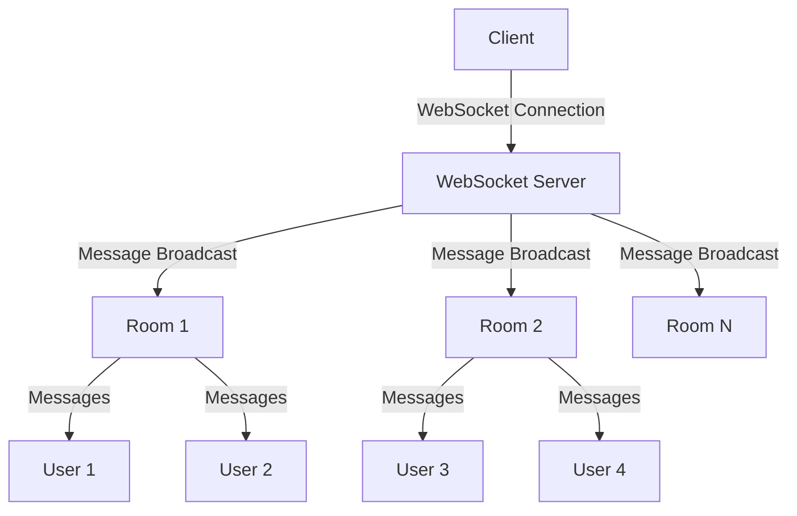
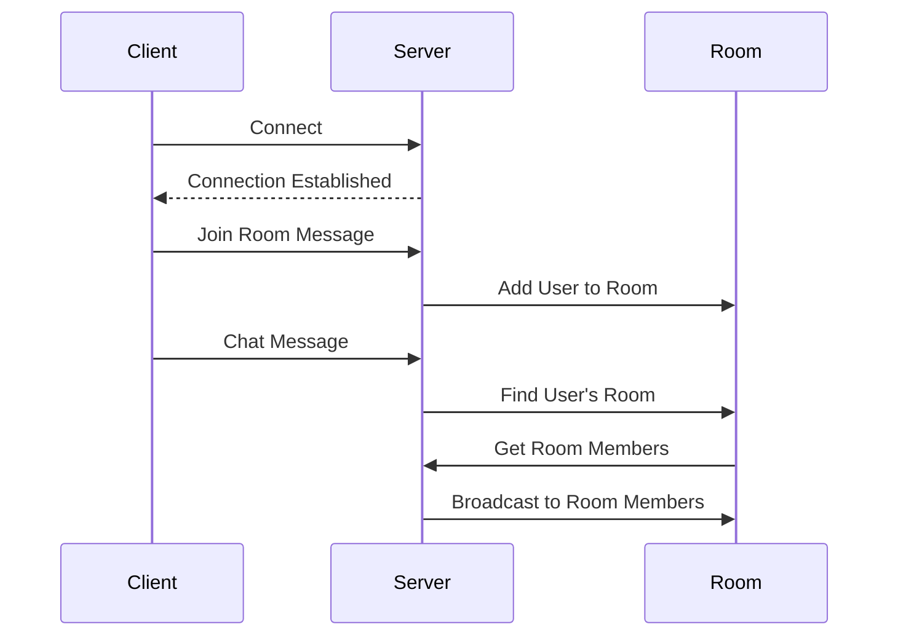

# WebSocket Chat Application

A real-time chat application built with WebSocket (ws) and TypeScript that supports multiple chat rooms.

## 🌟 Features

- Real-time messaging
- Multiple chat room support
- TypeScript implementation
- Lightweight and efficient
- Room-based message broadcasting

## 🔧 Technology Stack

- TypeScript
- WebSocket (ws)
- Node.js

## 📊 System Architecture



## 🔄 Message Flow



## 📝 Message Types

### Join Room Message
```typescript
{
    type: "join",
    payload: {
        roomId: string
    }
}
```

### Chat Message
```typescript
{
    type: "chat",
    payload: {
        message: string
    }
}
```

## 🚀 Getting Started

1. Clone the repository
2. Install dependencies:
   ```bash
   npm install
   ```
3. Start the server:
   ```bash
   npm run dev
   ```

## 📡 WebSocket Client Example

```javascript
const ws = new WebSocket('ws://localhost:8080');

// Join a room
ws.send(JSON.stringify({
    type: 'join',
    payload: {
        roomId: 'room1'
    }
}));

// Send a message
ws.send(JSON.stringify({
    type: 'chat',
    payload: {
        message: 'Hello, room!'
    }
}));

// Listen for messages
ws.onmessage = (event) => {
    console.log('Received:', event.data);
};
```

## 🏗️ Project Structure

```
.
├── src/
│   └── index.ts      # Main WebSocket server implementation
├── dist/
│   └── index.js      # Compiled JavaScript
├── package.json      # Project configuration
└── tsconfig.json     # TypeScript configuration
```

## 💻 Development

The project uses TypeScript for type safety and better development experience. The server automatically handles:

- User connections/disconnections
- Room management
- Message broadcasting to room members

## 🔒 Security Considerations

- Messages are only broadcast to users in the same room
- Basic input validation for message types
- Automatic cleanup of disconnected users

## 🤝 Contributing

1. Fork the repository
2. Create a feature branch
3. Commit your changes
4. Push to the branch
5. Open a Pull Request

## 📄 License

ISC License
